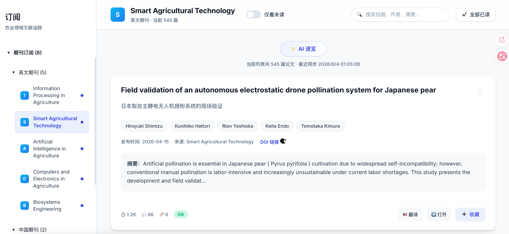

<div align="center">

# 🌾 Agricultural Journal Tracker

**Intelligent tracking system for top agricultural journals and preprints**

Track the latest papers in agricultural engineering, smart agriculture, and agricultural informatics.
Also useful for surveying technical papers on AI coding tools (Claude Code / Codex / Cursor Agent, etc.).

[](LICENSE)
[](https://nodejs.org/)
[](https://python.org/)
[](https://react.dev/)
[](https://vitejs.dev/)

[**English**](README.md) · [**中文**](README.zh-CN.md)

[Preview](#-preview) · [Quick Start](#-quick-start) · [Supported Journals](#-supported-journals) · [Project Structure](#-project-structure) · [Extending](#-extending) · [Changelog](#-changelog)

</div>

---

## 📸 Preview



*Three-pane reading interface: journal subscription tree on the left, paper list in the middle, detail drawer on the right.*

---

## ✨ Features

- 📰 **Three-pane reading interface** — journal tree on the left / paper list in the middle / detail drawer on the right
- 🔄 **Automatic incremental fetching** — daily updates via the OpenAlex API with no duplicates
- 🔖 **Reading state management** — mark as read / favorite, persisted locally
- 🔍 **Full-text search & filter** — search by title, author, or keyword
- 🌏 **Multilingual support** — English journals + Chinese journals + arXiv preprints + AI translation
- 📊 **Statistics dashboard** — paper counts per journal and time-trend visualization
- 📱 **Responsive design** — works on desktop and mobile
- 🔁 **Auto abstract enrichment** — Semantic Scholar / Crossref / Unpaywall fallback, with a progressive 7-day retry queue

---

## 🚀 Quick Start

### Requirements

| Tool      | Version |
| --------- | ------- |
| Node.js   | ≥ 18    |
| Python    | ≥ 3.8   |
| npm       | ≥ 9     |

### Installation

```bash
# 1. Clone the repository
git clone https://github.com/your-username/agricultural-journal-tracker.git
cd agricultural-journal-tracker

# 2. Install frontend dependencies
npm install

# 3. Install Python dependencies
pip install requests deep-translator pypdf
```

### Run

```bash
# Fetch the latest papers (default: look back 365 days)
python3 scripts/fetch_papers.py

# Backfill missing abstracts for existing papers
python3 scripts/fetch_papers.py --backfill

# Start the frontend dev server
npm run dev
```

Open **http://localhost:5173** in your browser.

### Production build

```bash
npm run build
# Build output is in the dist/ directory
```

### Scheduled auto-update

**macOS / Linux:**

```bash
chmod +x scripts/setup_task.sh
./scripts/setup_task.sh
```

**Manual cron (every day at 8 AM):**

```bash
crontab -e
# Add:
0 8 * * * cd /path/to/project && python3 scripts/fetch_papers.py
```

---

## 📰 Supported Journals

### English journals (via OpenAlex API)

| Journal                              | Field                            |
| ------------------------------------ | -------------------------------- |
| Information Processing in Agriculture | Agricultural information processing |
| Smart Agricultural Technology        | Smart agricultural technology     |
| Artificial Intelligence in Agriculture | AI in agriculture              |
| Computers and Electronics in Agriculture | Computing & electronics in agriculture |
| Biosystems Engineering               | Biosystems engineering            |

### Chinese journals

| Journal | ISSN |
| ------- | ---- |
| 农业工程学报 (Transactions of the CSAE) | 1002-6819 |
| 农业机械学报 (Transactions of the CSAM) | 1000-1298 |

### Preprints

| Source | Categories |
| ------ | ---------- |
| arXiv  | cs.CV, cs.LG, cs.AI, cs.CL |

---

## 📁 Project Structure

```
agricultural-journal-tracker/
├── src/
│   ├── App.jsx              # Main app component (three-pane layout)
│   ├── main.jsx             # React entry
│   └── styles.css           # Global styles
├── scripts/
│   ├── fetch_papers.py      # Main Python crawler (OpenAlex + arXiv)
│   ├── fetch_papers_v2.py   # Upgraded crawler
│   ├── fetch-papers.js      # Node.js crawler
│   └── setup_task.sh        # Scheduled-task installer (Linux/macOS)
├── public/
│   ├── papers.json          # Paper data (auto-generated)
│   ├── journal_info.json    # Journal metadata
│   └── crawler_state.json   # Crawler state
├── storage/
│   ├── papers.db            # SQLite database
│   └── knowledge_base.json  # Local knowledge base
├── docs/
│   └── images/              # README screenshots
├── package.json
├── vite.config.js
├── README.md
└── README.zh-CN.md
```

---

## 🔌 Data Sources

### OpenAlex API

[OpenAlex](https://openalex.org/) is a completely free and open scholarly graph. It provides paper titles, abstracts, authors, publication dates, journals, DOIs, citation counts, keywords, and Open Access full-text links.

Docs: https://docs.openalex.org/

### arXiv

Preprints are scraped from the arXiv listing pages for categories such as `cs.CV`, `cs.LG`, `cs.AI`, `cs.CL`. Useful for surveying literature on AI coding tools (Claude Code, Codex, Cursor Agent, etc.).

---

## ⚙️ Extending

### Add a new journal

Edit `scripts/fetch_papers.py`:

```python
JOURNALS = {
    "New Journal Name": {
        "search_name": "Journal Search Name",
        "alternate_names": ["Alternative Name"]
    }
}
```

### Add more arXiv categories

Add entries to `CV_JOURNALS` in `scripts/fetch_papers.py`:

```python
CV_JOURNALS = {
    "arXiv cs.LG": {"source": "arxiv", "category": "cs.LG"},
    "arXiv cs.CL": {"source": "arxiv", "category": "cs.CL"},
}
```

### Add another abstract source

Add a new API function (see `get_semantic_scholar_abstract` in `scripts/fetch_papers.py`) and call it from `get_best_effort_abstract` in priority order.

---

## 🗺️ Roadmap

- [x] English journal tracking (OpenAlex API)
- [x] arXiv preprint tracking
- [x] Incremental updates / no duplicates
- [x] Read / favorite state persistence
- [x] Full-text search
- [x] Multi-source abstract enrichment (Semantic Scholar / Crossref / Unpaywall)
- [x] Progressive retry mechanism
- [ ] Full Chinese journal integration (CNKI / Wanfang)
- [ ] AI-generated paper summaries
- [ ] Email / push notifications
- [ ] Keyword subscription filters
- [ ] Paper notes
- [ ] Docker one-click deployment
- [ ] Deep integration with Claude Code / Cursor Agent

---

## 🤝 Contributing

Issues and Pull Requests are welcome!

1. Fork this repository
2. Create a feature branch: `git checkout -b feature/your-feature`
3. Commit your changes: `git commit -m 'Add some feature'`
4. Push the branch: `git push origin feature/your-feature`
5. Open a Pull Request

---

## 📄 License

This project is open-sourced under the [MIT License](LICENSE).

---

## 📝 Changelog

### v0.3.0 (2026-04-19)

- Added multi-source abstract fetching via Semantic Scholar / Unpaywall
- Added `--backfill` flag to bulk-fill missing abstracts
- Added progressive 7-day retry queue (auto-retry papers that previously failed)
- Extended the abstract enrichment window for English journals to 180 days
- Frontend: added a "View original" button for papers without abstracts

### v0.2.0 (2026-04-19)

- Added arXiv cs.CV preprint tracking
- Improved UI interactions and responsive layout

### v0.1.0 (2026-04-03)

- Refactored project architecture; integrated the OpenAlex API
- Implemented the three-pane layout
- Added paper favoriting and read-marking
- Added the statistics panel

---

<div align="center">

Made with ❤️ for researchers and AI developers

</div>
